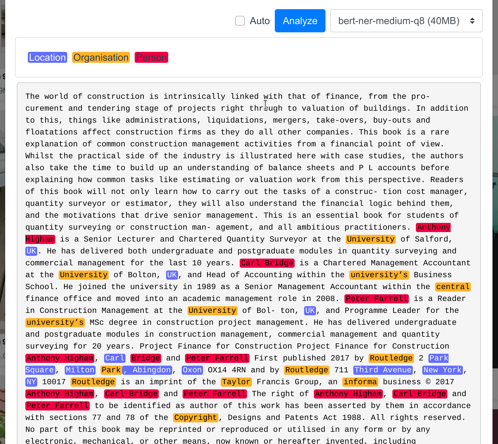

# sist2 NER repository

### How to use with sist2

With sist2 v3.0.4+, go to **Configuration** > **Machine learning options** > **Model repositories** and add this line:

```
https://raw.githubusercontent.com/simon987/sist2-ner-models/main/repo.json
```

Then reload the page.



## Models

Models with `-q8` indicates 8-bit quantization and `-q16` 16-bit quantization. Smaller models are faster and better suited
for low-spec devices. Larger models are more accurate.

1.`bert-ner-*` General purpose model trained on [tner/btc](https://huggingface.co/datasets/tner/btc), [tner/conll2003](https://huggingface.co/datasets/tner/conll2003)
and [tner/wnut2017](https://huggingface.co/datasets/tner/wnut2017) for 10 epochs.

### How to train models:

with Python 3.9
```bash
pip install -r requirements.txt
# For GPU support, follow instructions here: https://www.tensorflow.org/install/pip
bash train.sh
```

### Hacking

Feel free to clone and modify the models for your use-case. You can publish the models on GitHub or any static web hosting platform. PRs welcome!